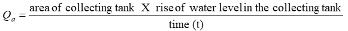

This folder has 

### Aim: 
To determine the co-efficient of discharge (Cd), co-efficient of velocity (Cv) of orifice and co-efficient of contraction(Cc).

### THEORY

Orifice is an opening or a hole of any size, shape or form through which liquid flow such that its upper edge remains below the free surface of the liquid. Orifices are used for measurement of control of flow. Orifices may have any shape but generally they are circular, square or rectangular.

When a liquid flows from a vessel or a tank, through an orifice it changes its direction. Due to this change of direction of the liquid, the jet is acted upon by lateral or side forces, which gradually reduce its area up to certain section. This area does not reduce further beyond, which the jet ceases and streamlines, first become parallel is known as the vena contracta.

### Actual Discharge (Qa): 
The water flowing through the section of a pipe or a channel under the steady state conditions is collected in a collecting tank for a known time t. The rise of water level in the collecting tank is noted down. The actual discharge is

### Coefficient of Discharge (Cd): 
The ratio of actual discharge (Qa) through an orifice to the theoretical discharge (Qt) is known as coefficient of discharge. It is denoted by Cd. 
