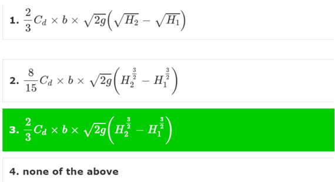
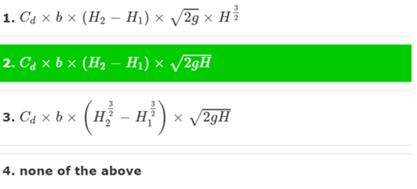
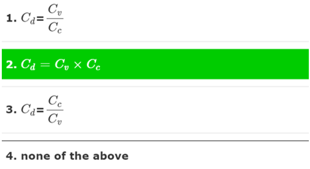
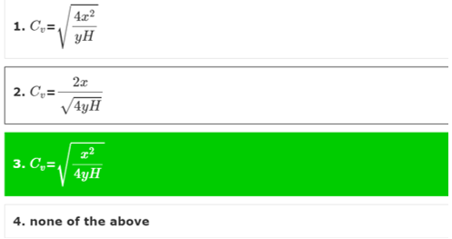

## <b> POST TEST </b>

1. The ratio of actual discharge of a jet of water at vena-contracta to the theoretical discharge is known as ? 
a) co-efficient of discharge 
b) co-efficient of velocity 
c) co-efficient of contraction 
d) co-efficient of viscosity 

2. The ratio of actual velocity of a jet of water at vena-contracta to the theoretical velocity is known as ? 
a) co-efficient of discharge 
b) co-efficient of velocity 
c) co-efficient of contraction 
d) co-efficient of viscosity 

3. Orifices are used to measure ? 
a) velocity 
b) pressure 
c) rate of flow 
d) none of the above 

4. The co-efficient of discharge (Cd)? 
a) for an orifice is more than that for a mouthpiece 
b) for internal mouthpiece is more than that for external mouthpiece 
c) for a mouthpiece is more than that for an orifice 
d) none of the above 

5. The ratio of the area of the jet of water at vena-contracta to the area of orifice is known as ? 
a) co-efficient of discharge 
b) co-efficient of velocity 
c) co-efficient of contraction 
d) co-efficient of viscosity 

6. In case of flow through orifices, the coefficient of velocity at vena-contacta is 
a)	Equal to zero 
b)	Equal to one 
c)	Greater than one 
d)	Less than one 

7. The discharge through a large rectangular orifice is? where b=width of orifice,H1=Height of liquid above top edge of the orifice,H2=Height of liquid above bottom edge of the orifice.

8. The discharge through fully submerged orifice is? where H=Difference of liquid levels on both sides of the orifice, H1=Height of liquid above top edge orifice of upstream side, H2=Height of liquid above bottom edge of orifice on upstream side.

9. The co-efficient of discharge (Cd) in terms of (Cv) and (Cc) is ?

10. The co-efficient of velocity (Cv) for an orifice is ? 

